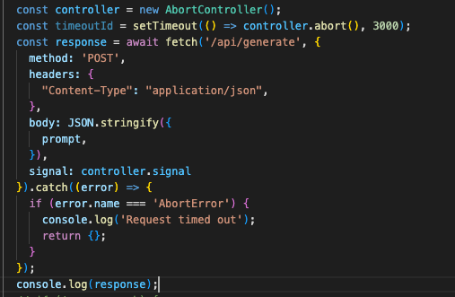

# Ajax Timeout

ajax设置timeout用于处理请求时间过长，导致客户端长时间等待的情况。常发生在服务器繁忙或者网络连接不佳的情况下。

当服务响应时间超过timeout时，可以采取取消请求、显示错误信息或执行其他逻辑。

## timeout实际使用
timeout一般默认值是0，即请求没有超时限制，当设置timeout后，如果请求时间超过timeout的值，就会触发超时事件，通过浏览器向服务器发送abort请求，取消当前的请求（也可以利用promise.race丢弃超时的请求）。即使服务器在超时后返回了数据，数据会被忽略，因为请求已经取消了

### fetch


### axios
```javascript
const instance = axios.create({
  timeout: 5000 // request timeout
});


instance.interceptors.response.use(function (response) {
    return response;
  }, function (error) {
    if(error.message.includes('timeout')){ 
      console.log("错误回调", error);
      alert("网络超时");
    }
    return Promise.reject(error);
  });
```

### 利用promise.race丢弃超时请求，实现超时功能
```javascript
const fetchPromise = fetch('/api/data');
const timeoutPromise = new Promise((resolve, reject) => { 
  setTimeout(() => {
    reject(new Error('Request timed out'));
  }, 5000); // timeout
});

Promise.race([fetchPromise, timeoutPromise])
  .then((response) => {

  })
  .catch((error) => {

  });
```


## 总结
使用Ajax timeout可以确保请求在规定时间内得到响应，避免出现意外情况导致长时间等待或请求超时的情况。
